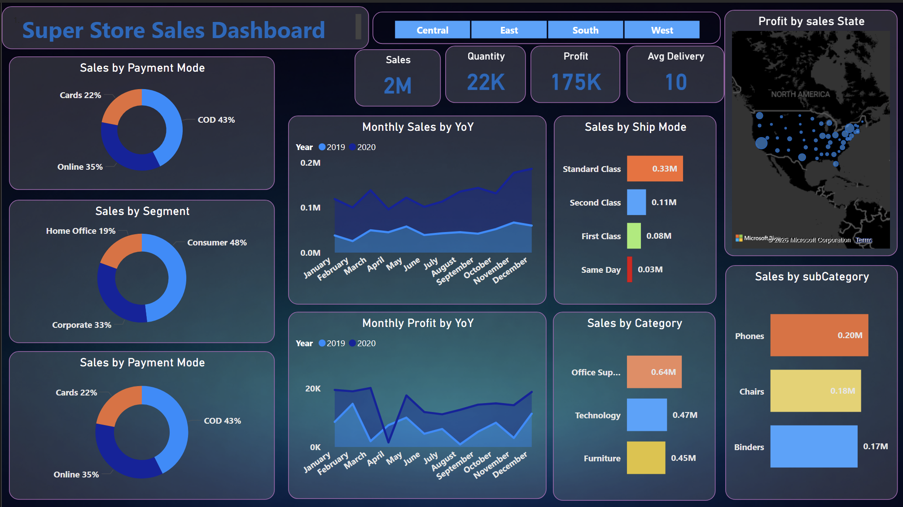
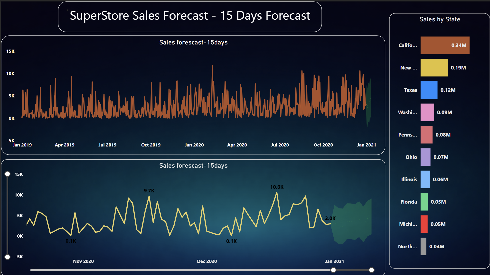

# Superstore Sales Dashboard (Power BI)

## 📊 Project Overview

This project presents an interactive **Sales Analysis Dashboard** built using **Power BI** based on the Superstore dataset.
The dashboard provides insights into sales performance, profit trends, customer segments, and regional performance.

The goal of this project is to demonstrate **data analysis, business intelligence, and visualization skills** using Power BI.

---

## 🚀 Features

* Sales analysis by **category and sub-category**
* Profit and sales trends **year-over-year**
* Sales distribution by **payment mode and segment**
* Regional sales analysis using **map visualization**
* Shipping mode analysis
* **15-day sales forecast**

---

## 🛠 Tools & Technologies

* **Power BI**
* **Data Visualization**
* **Business Intelligence**
* **Superstore Dataset**

---

## 📈 Dashboard Preview

### Main Dashboard

### Sales Forecast Dashboard

---

## 📂 Project Files

* `SuperStore_Sales_Dashboard.pbix` → Power BI dashboard file
* `dashboard1.png` → Main dashboard screenshot
* `dashboard2.png` → Forecast dashboard screenshot

---

## 📊 Key Insights

* Consumer segment contributes the highest sales.
* Technology and Office Supplies categories generate significant revenue.
* Sales show seasonal fluctuations with growth in later months.
* Forecasting indicates potential future sales trends.

---

## 📥 How to Use

1. Download the `.pbix` file.
2. Open it using **Power BI Desktop**.
3. Explore interactive visualizations and filters.

---

## 👨‍💻 Author

**Vaibhav Pratap Singh Rajawat**
B.Tech Data Science Student
SRM Institute of Science and Technology

---

⭐ If you found this project useful, consider giving it a **star** on GitHub!
